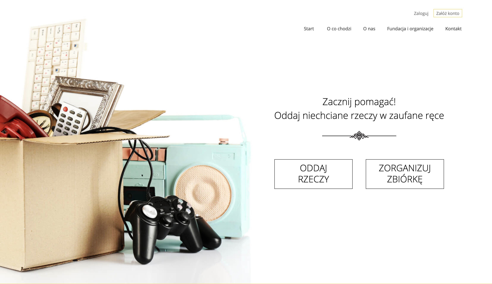
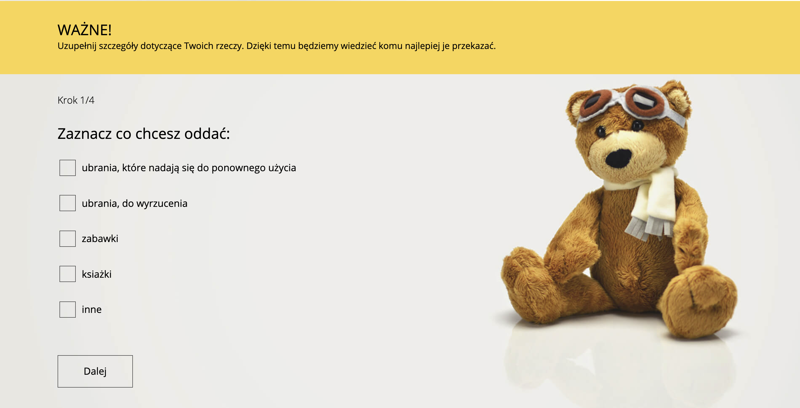
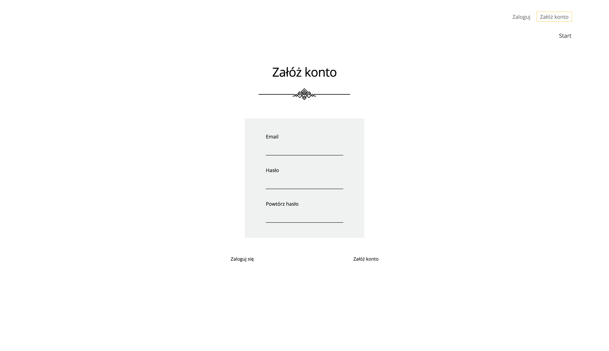

# Give Away for those in need!

> **Concept**: Giveaway unnecessary things (toys, clothes, books and other) to those in need. Create an account, sign in and make a donation for those who need it the most.


## 🌍 Accessibility

```Check it online:``` https://oddam-rzeczy-23ac5.web.app/

Login for the test account:

login: ```test@test.com```
hasło: ```test123```
### 🏠 Landing page

### 💝 Give Away Form

### 📝 Registration Form



## 💥 Application

- Scrollable Landing page - divided for 5 parts
- Register new account and login easly
- Toggling menu bar
- Give away subpage available only for logged users
- Multistage component with pagination
- Foundations/Organisations/Collections list
- Verified contact form
- 6-steps give away form with stored data (you can go back and change options)

## 👌 Functions
* Responsive Web Design (RWD)
* All donations are saved in the Cloud Firestore database

## 📓 Used Technologies:

- Create React App
- React
- React Router
- React Scroll
- React Form
- React Hooks
- React Hamburger menu
- Controlled form
- Pagination
- Node Sass
- Firebase Auth
- Firebase Cloud Firestore
- Firebase API
- Firebase Hosting
- Data validation


## ⚙️ How to install:
1. ``` git clone https://github.com/konradgauza/GiveAway.git ```
2. ``` cd GiveAway ```
3. ``` npm i ```
4. ``` npm start ```

